# 🌱 Sprout — A Gardening Assistant That Remembers

Sprout is a fully serverless gardening assistant you talk to through Telegram. It
remembers the plants you grow, your care schedules, your climate zone, and your
preferences across conversations — so its advice gets better over a whole season.

Sprout is built with [**OpenClaw**](https://github.com/openclaw) as the agent
substrate (its own agent loop, skills system, and tool use) running on **Amazon
Bedrock AgentCore Runtime**, with **Amazon Bedrock AgentCore Memory** providing
cross-session recall. The entire stack deploys from a single CloudFormation
template — no CDK, no build tooling required to launch.

This repository is the companion to the blog post _"The Assistant That Remembers:
Building a Context-Aware Personal AI with Amazon Bedrock AgentCore and OpenClaw."_

## 🚀 Launch Stack

Deploy the whole thing in one click. The AWS CloudFormation console opens with the
template parameters pre-populated for you to fill in (you'll need a Telegram bot
token — see [Prerequisites](#prerequisites)).

[](https://console.aws.amazon.com/cloudformation/home#/stacks/quickcreate?templateURL=https://raw.githubusercontent.com/aws-samples/sample-agentcore-memory-openclaw/main/openclaw-telegram.yaml&stackName=sprout)

> The Launch Stack button uses a publicly hosted container image from Amazon ECR
> Public, so it works immediately without building anything locally. After the
> stack reaches `CREATE_COMPLETE`, register the webhook URL with Telegram (the
> [deploy script](#option-a--guided-deploy-script-recommended) does this
> automatically, or do it manually per Option B below).

## Why Telegram (and why it's cheap)

Unlike a Discord-based variant — which needs a persistent EC2 instance to hold a
WebSocket connection — this Telegram version is fully serverless. API Gateway +
Lambda handle inbound webhooks, and the AgentCore Runtime container freezes
between invocations, so you only pay for active usage. That brings the baseline
infrastructure cost down to roughly **$1–2/month** plus per-message model usage.

## Architecture

Sprout connects Telegram to an OpenClaw agent on AgentCore Runtime. AgentCore
Memory stores session events and asynchronously extracts long-term records that
get injected back into the agent's context at the start of each conversation;
registered garden sections are additionally written as structured records with
queryable metadata (see [Two ways facts reach memory](#two-ways-facts-reach-memory)).
For proactive reminders, the runtime creates EventBridge Scheduler schedules on
demand — when you agree to a reminder — and each one later wakes a Cron Lambda
that re-invokes the runtime to deliver a memory-driven nudge.

```mermaid
flowchart LR
    TG[Telegram Bot API]
    APIGW[API Gateway<br/>HTTPS POST /webhook]
    WH[Webhook Lambda]
    EB[EventBridge<br/>Scheduler]
    CRON[Cron Lambda]
    RT[AgentCore Runtime<br/>OpenClaw container linux/arm64<br/>server.py memory hooks]
    MEM[(AgentCore Memory<br/>sprout/&#123;chat_id&#125;/long_term<br/>sprout/&#123;chat_id&#125;/episodic)]
    S3[(S3 Workspace Store)]
    BR[Bedrock Model<br/>Claude Haiku 4.5]

    TG -->|webhook update| APIGW --> WH
    WH -->|InvokeAgentRuntime| RT
    RT -->|response| WH -->|sendMessage| TG

    RT -->|CreateSchedule on demand| EB
    EB -->|reminder fires| CRON -->|InvokeAgentRuntime cron| RT
    CRON -->|sendMessage| TG

    RT -->|RetrieveMemoryRecords / CreateEvent<br/>BatchCreateMemoryRecords| MEM
    RT -->|workspace read/write| S3
    RT -->|InvokeModel| BR
    MEM -. async extraction .-> BR
```



**How it flows:**

1. Telegram delivers a webhook update to **API Gateway**, which proxies it to the
   **Webhook Lambda**.
2. The Lambda invokes the **AgentCore Runtime** container with the Telegram chat
   ID as the user identity.
3. `server.py` retrieves relevant memories from **AgentCore Memory**, injects them
   into OpenClaw's system prompt, runs the agent turn, then persists the
   transcript as an event (triggering async long-term extraction).
4. **Registered garden sections** are also written as *structured* memory records
   (see [Two ways facts reach memory](#two-ways-facts-reach-memory)): when you
   send a captioned photo album of a bed, the runtime writes a record with
   queryable metadata (`type=section`, `section`, `plants`, `photo_count`).
5. **Proactive reminders** are created on demand: when the agent agrees to a
   reminder, `server.py` extracts the agreed time/recurrence from the turn and
   calls `scheduler:CreateSchedule` to create an **EventBridge Scheduler**
   schedule (in a dedicated group) targeting the **Cron Lambda**. When it fires,
   the Cron Lambda re-invokes the runtime (`invocation_type="cron"`), which
   recalls the gardener's memory and composes a personalized nudge — or nothing
   when nothing is due — and delivers it to Telegram. One-off reminders
   self-delete after firing; there is no periodic polling sweep.
6. The **S3 Workspace Store** persists OpenClaw skill data between container
   freezes.

## Two ways facts reach memory

Sprout writes to AgentCore Memory through two complementary paths. Knowing which
one applies explains what the agent can recall — and how precisely.

| | `CreateEvent` (extracted) | `BatchCreateMemoryRecords` (structured) |
|---|---|---|
| **What is written** | The conversation transcript | A record the app builds deliberately |
| **How facts appear** | Extraction strategies derive them asynchronously | Written synchronously, exactly as specified |
| **Metadata** | Whatever extraction attaches | Explicit: `type`, `section`, `plants`, `photo_count` |
| **Used for** | Everyday chat (preferences, climate zone, plant talk) | Registering a named backyard section from a photo album |

Every turn is persisted with `CreateEvent`, so the three configured strategies
(user preference, semantic, summarization) keep deriving long-term records from
ordinary conversation. On top of that, when you register a bed by captioning a
photo album, `server.py` writes a **structured** record so "what's in the north
bed" is a durable, queryable fact rather than something extraction may or may not
infer from chat text. A focused JSON-only extraction pass pulls the plant names
out of the agent's own description to populate the `plants` list.

### Querying custom metadata

Custom metadata is stored on the record and returned on retrieval, but
`RetrieveMemoryRecords`' server-side `metadataFilters` only accepts reserved
`x-amz-agentcore-memory-*` keys — a custom key such as `section` is rejected with
`not a valid filter key`. Sprout therefore retrieves semantically (scoped to the
user's namespace) and filters custom metadata **client-side**:

```python
# "which beds have basil?" — list-membership match, case-insensitive
memory.retrieve(chat_id, "beds", metadata_filters={"plants": "basil"})
```

## Estimated Monthly Cost

Costs assume light personal usage (a handful of conversations per day) in
`us-east-1`. Model usage dominates; everything else is effectively rounding error
thanks to the serverless, freeze-when-idle design.

| Service | Usage assumption | Est. monthly cost |
|---|---|---|
| AgentCore Runtime | Freezes when idle; billed for active invocation time only | ~$0.50 |
| AgentCore Memory | Short-term events + async extraction, light volume | ~$0.25 |
| Lambda (webhook + cron) | Well within free tier for personal use | ~$0.00 |
| API Gateway (HTTP API) | Thousands of webhook requests/month | ~$0.01 |
| EventBridge Scheduler | On-demand reminder schedules, a handful active at a time | ~$0.00 |
| S3 + KMS + Secrets Manager | Tiny workspace storage, 1 CMK, 2 secrets | ~$1.00 |
| CloudWatch Logs | 30-day retention, low volume | ~$0.10 |
| Bedrock — Claude Haiku 4.5 (text chat) | ~30 messages/day via OpenClaw gateway; prompt caching cuts input cost ~90% | ~$1–3 |
| Bedrock — Claude Sonnet 4.6 (vision) | ~5 plant photos/day; ~$0.013/photo | ~$2 |
| **Total (typical personal use)** | | **~$5–9/month** |

### Model cost breakdown

Sprout uses two models, optimized for cost vs. accuracy:

| Model | Role | Input price | Output price | Per-call estimate |
|---|---|---|---|---|
| Claude Haiku 4.5 | Text chat (via OpenClaw gateway) | $1.00/M tokens | $5.00/M tokens | ~$0.003 |
| Claude Sonnet 4.6 | Plant image identification (direct Bedrock Converse) | $3.00/M tokens | $15.00/M tokens | ~$0.013 |

A plant photo is typically ~1,000–1,500 image tokens. The system prompt (persona +
memory context) adds ~800 tokens of input. With prompt caching enabled, repeated
text conversations reuse the cached prefix and pay only the reduced cache-read rate
($0.10/M), cutting the per-message input cost by ~90%.

> The `MonthlyBudgetLimit` parameter (default **$25**) creates an AWS Budget that
> alerts you at 80% and 100% of your limit, so there are no cost surprises.

## Prerequisites

- An **AWS account** with permissions to create IAM roles, Lambda functions, API
  Gateway, S3, KMS, Secrets Manager, and Bedrock AgentCore resources.
- **Amazon Bedrock model access** enabled for Claude Haiku 4.5 (or your chosen
  model) in your deployment region.
- A **Telegram bot token** from [@BotFather](https://t.me/BotFather). Open
  Telegram, message BotFather, run `/newbot`, and copy the token it gives you.
- For the script-based deploy: **AWS CLI**, **Docker** (with `buildx`), and
  **curl** on your `PATH`.

## Quick Start

### Option A — Guided deploy script (recommended)

The deploy script validates the template, builds and pushes the `linux/arm64`
container image to ECR, creates or updates the stack, and registers the Telegram
webhook for you — all in one command.

```bash
# 1. Clone the repository
git clone https://github.com/aws-samples/sample-agentcore-memory-openclaw.git
cd sample-agentcore-memory-openclaw

# 2. Create your local config from the template and fill in your values
cp .env.example .env
# Open .env and set at least TELEGRAM_BOT_TOKEN (from BotFather). The other
# values have sensible defaults — see the comments in .env.example.
# NOTE: .env holds your bot token and is gitignored — never commit it.

# 3. Deploy — the script loads .env automatically
./scripts/deploy.sh
```

When the script finishes, message your bot on Telegram and say hello — Sprout is
live.

The deploy script reads its configuration from `.env`. Any variable already set
in your shell takes precedence, so you can still override a single value inline
without editing `.env`:

```bash
# Example: override the stack name and budget for one run
STACK_NAME="mygarden" MONTHLY_BUDGET_LIMIT="25" ./scripts/deploy.sh
```

See `.env.example` for the full list of supported variables (region, model id,
vision model, budget, log retention, alert email).

### Option B — One-click Launch Stack

1. Click the [**Launch Stack**](#-launch-stack) button above.
2. Fill in the `TelegramBotToken` parameter (and optionally `AlertEmail`, budget,
   and model). Create the stack.
3. After `CREATE_COMPLETE`, copy the `WebhookUrl` from the stack **Outputs** and
   register it with Telegram:

   ```bash
   curl --get \
     --data-urlencode "url=<WebhookUrl-from-stack-outputs>" \
     "https://api.telegram.org/bot<your-bot-token>/setWebhook"
   ```

   > Note: the one-click path uses the public container image and works
   > immediately. The deploy script (Option A) builds a private copy, which is
   > useful for custom modifications.

## Stack Parameters

| Parameter | Default | Description |
|---|---|---|
| `TelegramBotToken` | _(required)_ | Bot token from BotFather (stored encrypted in Secrets Manager) |
| `ModelId` | `us.anthropic.claude-haiku-4-5-20251001-v1:0` | Bedrock model ID / cross-region inference profile for text chat |
| `VisionModelId` | `us.anthropic.claude-sonnet-4-5-20250929-v1:0` | Bedrock model for plant image identification (vision); Sonnet is more accurate, Haiku stays on text to control cost |
| `MonthlyBudgetLimit` | `25` | Monthly budget in USD (1–10000); alerts at 80% and 100% |
| `AlertEmail` | _(empty)_ | Email for budget and operational alerts (optional) |
| `LogRetentionDays` | `30` | CloudWatch log retention in days |

## Community Skills

Sprout's gardening capabilities come from community skills declared in
[`agent-container/community-skills.json`](agent-container/community-skills.json).
They are resolved from ClawHub and materialized into `agent-container/skills/`
at deploy time (by `scripts/install-skills.sh`, before the Docker build), then
registered in `agent-container/openclaw.json` so the OpenClaw gateway loads them
at runtime:

- **weather** — frost warnings and growing-condition checks
- **scheduler** — watering and care schedule tracking with reminders
- **plant-notes** — recording and retrieving per-plant observations

Add or change skills by editing `agent-container/community-skills.json` and
re-running the deploy script. When a skill cannot be resolved from ClawHub, the
installer warns and falls back to a minimal local stub so the build still
succeeds.

## Mirroring base images to internal ECR

The agent container builds on two upstream base images — the official OpenClaw
release and `python:3.12-slim`. Container base images must be pulled from an
internal Amazon ECR repository rather than an external registry (such as Docker
Hub or GHCR), so the [`Dockerfile`](agent-container/Dockerfile) never references
those registries directly. It reads both base images from an `ECR_REGISTRY`
build argument instead:

```dockerfile
ARG ECR_REGISTRY
ARG OPENCLAW_BASE_IMAGE=${ECR_REGISTRY}/openclaw/openclaw:2026.2.26@sha256:...
ARG PYTHON_BASE_IMAGE=${ECR_REGISTRY}/python:3.12-slim
```

### Automatic (deploy script)

`scripts/deploy.sh` handles this for you. Before building, its mirror stage runs
[`scripts/mirror-base-images.sh`](scripts/mirror-base-images.sh) to copy both
upstream images into your account's ECR (repositories `openclaw/openclaw` and
`python`), then builds with
`--build-arg ECR_REGISTRY=<account>.dkr.ecr.<region>.amazonaws.com`.
`docker buildx imagetools create` copies each manifest verbatim, so the OpenClaw
digest pin is preserved through the mirror. No extra action is needed beyond
running the deploy script.

### Manual (one-time mirror)

If you build the image yourself, run the mirror helper once, then build with the
registry arg. [`scripts/mirror-base-images.sh`](scripts/mirror-base-images.sh)
creates the destination repositories (`openclaw/openclaw` and `python`),
authenticates to your ECR, and copies both upstream images in with
`docker buildx imagetools create` (which preserves the OpenClaw digest pin). It
prints the resolved registry on stdout — with progress on stderr — so you can
capture it straight into the build:

```bash
# Mirror the base images and capture the resolved ECR registry
REGISTRY="$(./scripts/mirror-base-images.sh)"

# Build against the mirrored base images
docker buildx build --platform linux/arm64 \
  --build-arg ECR_REGISTRY="$REGISTRY" \
  -f agent-container/Dockerfile \
  -t "${REGISTRY}/sprout-agent:local" \
  --push .
```

The mirror resolves your account via `aws sts get-caller-identity` and targets
`us-east-1` by default; override with `AWS_REGION`, `AWS_ACCOUNT_ID`, or the
`*_UPSTREAM_IMAGE` / `*_ECR_REPO` / `*_ECR_TAG` variables if needed (see the
script header for the full list).

To bump the OpenClaw version later, re-mirror the new tag + digest (via the
`OPENCLAW_UPSTREAM_IMAGE` and `OPENCLAW_ECR_TAG` overrides), update the pinned
values in the Dockerfile, and re-run your container image scan.

## Project Layout

```
.
├── openclaw-telegram.yaml     # Single CloudFormation template (the whole stack)
├── agent-container/           # OpenClaw container: server.py, openclaw.json, Dockerfile,
│                              #   community-skills.json, skills/
├── telegram-webhook/          # Webhook + cron Lambda handlers
├── scripts/deploy.sh          # Full deployment orchestrator (+ install-skills.sh)
├── scripts/mirror-base-images.sh # Mirror upstream base images into your ECR (used by deploy.sh)
├── scripts/push-public-image.sh  # Build & push to public ECR (used by pre-push hook)
├── .githooks/pre-push         # Auto-updates public image when agent-container/ changes
└── docs/                      # Configuration, troubleshooting, Telegram setup
```

### Developer setup (one-time)

To activate the pre-push hook that keeps the public container image in sync:

```bash
git config core.hooksPath .githooks
```

After this, any push to `main` that includes changes under `agent-container/`
will automatically rebuild and push the public ECR image so the Launch Stack
button always deploys the latest version.

## License

See the repository license for details.
