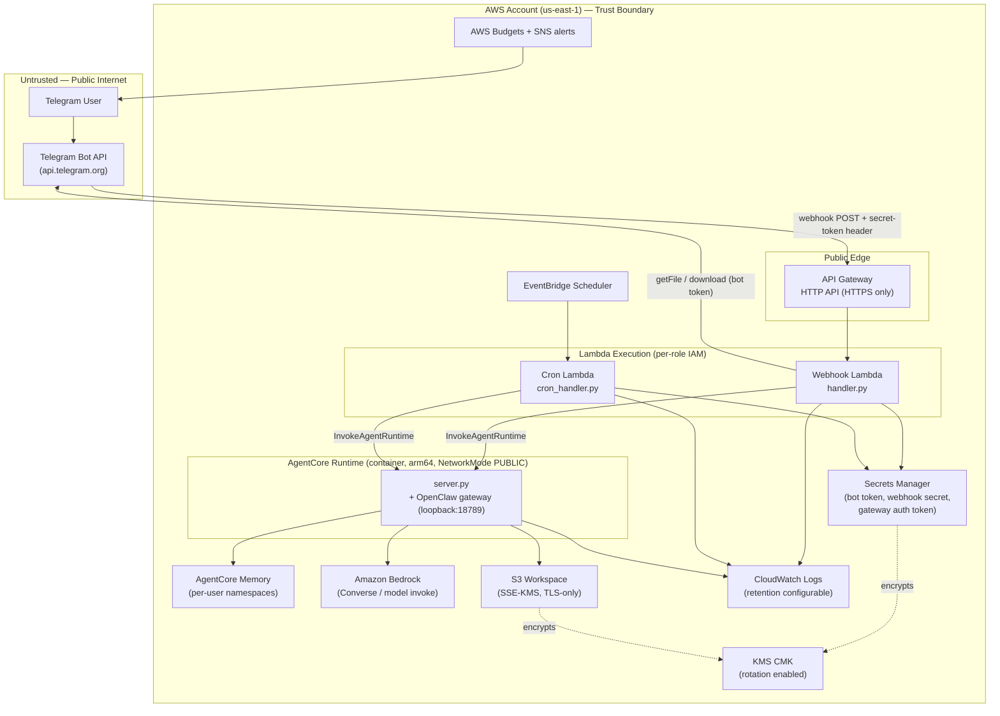

# Threat Model — Sprout Telegram Assistant on Bedrock AgentCore

> **Purpose.** This document is the threat model required by the AWS Public
> Content Security Review (PCSR) / AppSec review process for publishing this
> sample to `aws-samples`. It follows a STRIDE-based methodology, documents the
> system's trust boundaries and data flows, enumerates threats, and records the
> mitigation (or accepted residual risk) for each.
>
> **Sample-code scope.** This is educational sample code intended to demonstrate
> Amazon Bedrock AgentCore Runtime + AgentCore Memory with a Telegram front end.
> It is not intended for production use without additional hardening (see
> "Residual Risks & Assumptions"). No real end-user data, credentials, or
> account identifiers are shipped in the repository.

## 1. System Overview

Sprout is a serverless gardening assistant. A Telegram bot forwards user
messages to an API Gateway HTTP API, which invokes a Webhook Lambda. The Lambda
authenticates the request, downloads any attachments, and invokes an Amazon
Bedrock AgentCore Runtime container that wraps the OpenClaw agent and integrates
AgentCore Memory for cross-session recall. An EventBridge Scheduler drives a
Cron Lambda for proactive nudges.

### 1.1 Data Flow Diagram (with trust boundaries)

### 1.2 Trust boundaries

| # | Boundary | Crossing | Control |
|---|----------|----------|---------|
| TB-1 | Internet → AWS edge | Telegram webhook `POST /webhook` | HTTPS-only API Gateway; secret-token header validated in constant time before any processing |
| TB-2 | Webhook Lambda → Telegram API | `getFile`/download of user attachments | Bot token from Secrets Manager; size cap (20 MB); MIME allow-list for images |
| TB-3 | Lambda → AgentCore Runtime | `InvokeAgentRuntime` | IAM scoped to `runtime/*` in-account; per-chat session id |
| TB-4 | Runtime → Bedrock / Memory / S3 | data-plane calls | Scoped IAM execution role; per-user namespace + S3 prefix isolation |
| TB-5 | Runtime → OpenClaw gateway | loopback `/v1/chat/completions` | Bound to localhost:18789; bearer token (auto-generated, KMS-encrypted) |
| TB-6 | User content → LLM prompt | message text, captions, images | Prompt-injection handling (see §5, AI-specific threats) |

## 2. Assets

| Asset | Sensitivity | Where it lives |
|-------|-------------|----------------|
| Telegram bot token | High — controls the bot identity | Secrets Manager (`{stack}/telegram-bot-token`), KMS-encrypted; never logged; never committed |
| Webhook secret-token | High — authenticates inbound webhooks | Secrets Manager (`{stack}/webhook-secret`), auto-generated |
| OpenClaw gateway auth token | Medium — guards loopback endpoint | Secrets Manager (`{stack}/openclaw-auth-token`), auto-generated |
| User conversation content & photos | Medium — personal, not regulated PII by design | Transient in Lambda/runtime; long-term extracts in AgentCore Memory; workspace in S3 (SSE-KMS) |
| Per-user memory records | Medium | AgentCore Memory, namespace `sprout/{chat_id}/...` |
| KMS CMK | High — root of encryption | KMS, key rotation enabled |
| AWS account resources | High | Governed by scoped IAM roles + Budgets guardrail |

## 3. STRIDE Threat Analysis

Each threat is rated for pre-mitigation severity and marked **Mitigated**,
**Partial** (residual risk documented), or **Accepted** (sample-scope decision).

### 3.1 Spoofing

| ID | Threat | Severity | Mitigation | Status |
|----|--------|----------|------------|--------|
| S-1 | Attacker forges a webhook `POST` to the public API Gateway URL to inject fake Telegram updates | High | Telegram echoes a dedicated secret in `X-Telegram-Bot-Api-Secret-Token`; `handler.py` validates it with `hmac.compare_digest` (constant-time) and returns 401 before processing. Secret is 48-char auto-generated, separate from the bot token. | Mitigated |
| S-2 | Attacker guesses/reuses the webhook secret | Medium | Secret is high-entropy (48 alphanumeric chars) and KMS-encrypted at rest; rotatable via Secrets Manager without code change (token re-fetched every invocation). | Mitigated |
| S-3 | Spoofed calls to the OpenClaw loopback gateway | Low | Gateway binds to `localhost:18789` only (not exposed by the container network contract) and requires a bearer token (`OPENCLAW_AUTH_TOKEN`). | Mitigated |
| S-4 | Impersonating another user by supplying a different `chat_id` | Medium | `chat_id` is derived server-side from the authenticated Telegram update, not from client-controlled body fields the user can set independently. Requests without a valid secret-token never reach parsing. | Mitigated |

### 3.2 Tampering

| ID | Threat | Severity | Mitigation | Status |
|----|--------|----------|------------|--------|
| T-1 | Man-in-the-middle modifies webhook or Telegram API traffic | High | All transport is HTTPS: API Gateway HTTP API is HTTPS-only; Telegram API base is `https://`; S3 bucket policy denies `aws:SecureTransport=false`. | Mitigated |
| T-2 | Tampering with data at rest (S3 workspace, secrets) | Medium | S3 default SSE-KMS with the CMK; Secrets Manager encrypted with the same CMK; S3 versioning enabled to recover overwritten objects. | Mitigated |
| T-3 | Malicious/oversized attachment used to tamper with runtime | Medium | 20 MB size cap enforced on download; image MIME allow-list (`jpeg/png/gif/webp`); non-image documents forwarded as URL references, not executed. | Mitigated |
| T-4 | Tampering with the container image supply chain | Medium | Image built from a pinned base and published to a controlled ECR; `ContainerImageUri` is an explicit parameter; local builds tag each deploy with a unique version. See §6 supply chain. | Partial |

### 3.3 Repudiation

| ID | Threat | Severity | Mitigation | Status |
|----|--------|----------|------------|--------|
| R-1 | Actions cannot be attributed / audited | Low | CloudWatch Logs per component with configurable retention (`LogRetentionDays`); CloudTrail (account-level) records control-plane calls; each event keyed by `actorId` + `sessionId` in Memory. | Mitigated |
| R-2 | Logs grow unbounded or expose data | Low | Explicit log groups with retention (default 30 days); handlers log identifiers and error classes, not secret values or full message bodies. | Mitigated |

### 3.4 Information Disclosure

| ID | Threat | Severity | Mitigation | Status |
|----|--------|----------|------------|--------|
| I-1 | Cross-user memory/data leakage | High | Memory is namespaced `sprout/{chat_id}/long_term` and `.../episodic/{sessionId}`; retrieval is scoped to the caller's namespace; S3 workspace prefix is `workspace/{chat_id}/`. `derive_*_namespace` embeds the chat id as the sole variable segment so no two users collide. | Mitigated |
| I-2 | Secrets leaked in logs, source, or history | High | Secret-history scan of the repo is clean; `.env` is gitignored and never tracked; token read from Secrets Manager at runtime, never echoed; `NoEcho: true` on the CFN token parameter. | Mitigated |
| I-3 | S3 bucket public exposure | High | `PublicAccessBlockConfiguration` all four flags true; bucket policy grants only the runtime role; TLS enforced. | Mitigated |
| I-4 | Overly broad IAM enabling data access beyond need | Medium | Each role (runtime, memory, webhook, cron, scheduler) has a dedicated least-privilege policy scoped to account/region-qualified ARNs. `bedrock:InvokeModel` on `foundation-model/*` is required for cross-region inference profiles (documented, see §7). | Partial |
| I-5 | Sensitive data sent to the model provider | Medium | Bedrock is in-account/in-region; no third-party GenAI API is called. User content is processed only within the AWS account. | Mitigated |

### 3.5 Denial of Service

| ID | Threat | Severity | Mitigation | Status |
|----|--------|----------|------------|--------|
| D-1 | Flood of webhook requests drives cost/exhaustion | Medium | Invalid requests rejected at 401 before compute-heavy work; AWS Budgets guardrail (default $25/mo) with SNS alert; serverless scales but is cost-capped by alerting. Rate limiting is not enforced (see residual risk). | Partial |
| D-2 | Oversized/slow attachment downloads stall the Lambda | Low | 20 MB cap; 20 s per-file HTTP timeout; 55 s runtime-invoke budget below the 60 s Lambda timeout. | Mitigated |
| D-3 | Slow model/memory calls exhaust the invocation budget | Low | Memory retrieval bounded to 3 s and degrades to no-context; runtime read timeout 55 s; cron per-call 45 s with an 8 s budget floor. | Mitigated |
| D-4 | Unbounded cron fan-out | Low | Cron processes a bounded `chat_ids` list and stops before the 120 s ceiling. | Mitigated |

### 3.6 Elevation of Privilege

| ID | Threat | Severity | Mitigation | Status |
|----|--------|----------|------------|--------|
| E-1 | Compromised Lambda escalates to broader AWS access | High | Lambda roles limited to `InvokeAgentRuntime` on in-account runtimes, `GetSecretValue` on the specific secret ARN prefix, `kms:Decrypt`, and scoped log writes. No `iam:*`, no wildcard admin. | Mitigated |
| E-2 | Compromised runtime container accesses other accounts/resources | High | Runtime role scoped to in-account Bedrock, Memory data-plane actions on `memory/*` (CreateEvent, Retrieve/List, BatchCreate/BatchUpdate, DeleteMemoryRecord — records are namespaced per user in code), the specific workspace bucket (with `s3:DeleteObject` narrowed to the transient `albums/*` prefix), scoped logs, KMS, and EventBridge Scheduler on the `${StackName}-cron` group only (see E-4). `ecr:GetAuthorizationToken` requires `Resource: *` by API design (documented). | Partial |
| E-3 | Prompt-injected agent abuses tools to escalate | Medium | The runtime's only AWS-mutating capability is scoped EventBridge Scheduler management (E-4); it cannot modify IAM or other infra. See §4 (AI-1/AI-7) for prompt-injection specifics. | Partial |
| E-4 | Runtime `scheduler:CreateSchedule` + `iam:PassRole` abused to escalate | Medium | The runtime self-schedules reminders, so it holds `scheduler:Create/Update/Delete/Get/List` scoped to `arn:...:schedule/${StackName}-cron/*` and `iam:PassRole` restricted to the single `${StackName}-scheduler-role` with `Condition iam:PassedToService=scheduler.amazonaws.com`. It cannot pass any other role or create schedules outside the group; CronSchedulerRole itself can only `lambda:InvokeFunction` the invoker Lambda. So the worst case is creating reminder schedules that invoke the sample's own Lambda — no privilege escalation beyond that. | Mitigated |

## 4. Generative-AI–Specific Threats

Because this sample is an LLM agent, the standard OWASP LLM Top-10 style risks
are called out explicitly (PCSR reviewers of GenAI content expect this).

| ID | Threat | Severity | Mitigation | Status |
|----|--------|----------|------------|--------|
| AI-1 | **Prompt injection** via message text/caption ("ignore your instructions…") | Medium | System prompt/persona is a fixed prefix; user content is supplied as a separate turn. The agent's AWS-mutating capabilities are limited to EventBridge Scheduler management (proactive reminders), scoped by IAM to the `${StackName}-cron` schedule group and to `iam:PassRole` on the single CronSchedulerRole (PassedToService=scheduler) — see AI-7 / E-4 — and writing memory records into the caller's own namespace (see AI-3). It cannot change other infrastructure, IAM, or read other users' data (namespace isolation is enforced in code, not by the model). Blast radius of a hijacked instruction is limited to the agent's own reply plus creating/deleting reminder schedules within that one group. | Partial |
| AI-7 | **Prompt-injected schedule abuse** — attacker coaxes the agent into creating many reminder schedules or a high-frequency schedule (cost/nuisance) | Medium | Scheduler write access is IAM-scoped to the dedicated `${StackName}-cron` group only; created schedules can only target the invoker Lambda (which invokes the runtime and delivers to the *requesting* chat), so an attacker cannot message other users. Cost is bounded by the Budgets guardrail. Residual: no per-user schedule-count/rate cap yet — a production deployment should add one. | Partial |
| AI-2 | **Indirect / image-based injection** (instructions embedded in a photo or a forwarded document) | Medium | Images go to the vision model for identification only; documents are forwarded as URL references, not fetched-and-executed. Same tool-limitation blast-radius control as AI-1. | Partial |
| AI-3 | **Memory poisoning** — user coaxes the agent into persisting false or malicious "facts" | Medium | Two write paths, both namespaced per user, so poisoning only ever affects the poisoning user's own context. (1) Extraction is server-side via managed AgentCore strategies; Explicit-over-Inferred conflict resolution limits inferred-record influence. (2) Structured section records are written by `server.py` via `BatchCreateMemoryRecords` — the namespace is derived in code from the validated chat id (never from model output), and the model influences only the record's descriptive text and plant list, not its owner. Residual: a user can still store misleading text about their own garden. | Partial |
| AI-4 | **Cross-user memory disclosure** through the model | High | Retrieval is scoped to the caller's namespace before records ever reach the prompt; the model only ever sees the current user's memories. Enforced in `SproutMemory.retrieve` / `derive_long_term_namespace`. | Mitigated |
| AI-5 | **Sensitive output / over-collection** — agent stores more than needed | Low | `EventExpiryDuration: 30` days bounds event retention; sample persona focuses on gardening; no request for regulated PII. | Mitigated |
| AI-6 | **Model-driven cost abuse** (long outputs, loops) | Low | Budgets guardrail + alerting; two-model routing keeps text on the cheaper model; reply length split/capped for Telegram. | Mitigated |

## 5. Third-Party & Supply-Chain

| ID | Threat | Severity | Mitigation | Status |
|----|--------|----------|------------|--------|
| SC-1 | OpenClaw container / Node dependency vulnerabilities | Medium–High | OpenClaw is pinned to `2026.2.26` (tag+digest) — the release compatible with the Bedrock inference-profile model ids this project requires (newer builds dropped that support, OpenClaw issue #55642). A trivy scan of that base shows a high third-party CVE count: the Debian OS layer (173 CRIT / 1091 HIGH) is **not shipped** (final image rebuilds on `python:3.12-slim` + `apt upgrade`, copying only `/app`), but the Node layer (19 CRIT / 220 HIGH) and Go dev binaries (26 HIGH) in `/app` **do** ship. Blast radius is bounded: gateway is loopback-only behind a bearer token and the runtime IAM role is least-privilege. Remediation options in `security-scans/README.md`. **Requires Guardian review of the version tradeoff.** | Partial — open |
| SC-2 | Python dependency vulnerabilities (boto3, requests) | Low | Minimal dependency surface; pin versions in `requirements.txt`; rely on q-scanner/Probe/`pip-audit` in the review pipeline. | Partial |
| SC-3 | Typosquatting / malicious package | Low | Only well-known packages (`boto3`, `requests`); no unusual transitive additions. | Mitigated |
| SC-4 | Publicly hosted image URI (one-click deploy) points somewhere untrusted | Medium | Avoided by design: this sample publishes **no** prebuilt image and ships **no** one-click Launch Stack button. `ContainerImageUri` defaults to a non-functional `<ECR_PUBLIC_ALIAS>` placeholder, and `scripts/deploy.sh` overrides it with an image built and pushed into the deployer's own ECR — so operators only ever run an image they built. Re-opens if a prebuilt image is ever published, which would require an AWS-owned, scanned ECR Public repository. | Mitigated |

## 6. Required Scans (evidence for the PCSR ticket)

Run these and attach results / remediation evidence to the ticket:

- **Static analysis (Python):** `bandit -r telegram-webhook agent-container`
- **IaC:** `cfn-lint openclaw-telegram.yaml` and `checkov -f openclaw-telegram.yaml`
- **Secrets:** `detect-secrets scan` / `gitleaks detect` across the repo and full git history
- **Dependencies:** `pip-audit -r telegram-webhook/requirements.txt -r agent-container/requirements.txt`
- **Container image:** scan the built arm64 image (ECR enhanced scanning / Inspector, or `trivy image`)
- **In GitFarm/GitLab/Slingshot:** CRUX (q-scanner + acat), Probe, or Slingshot upload per the PCSR checklist

Remediate all High/Critical findings and attach evidence (re-scan, CR links, or
exported Slingshot results showing no remaining High/Critical).

## 7. Residual Risks & Assumptions (sample-scope)

1. **No application-layer rate limiting** on the webhook beyond auth + Budgets
   (D-1). Production users should add WAF/usage plans or throttling.
2. **`bedrock:InvokeModel` on `foundation-model/*`** and
   **`ecr:GetAuthorizationToken` on `*`** are wildcards required by the
   respective AWS APIs (cross-region inference profiles; ECR auth token is not
   resource-scopable). These are intentional and documented, not an oversight.
3. **`kms:Decrypt` on `key/*`** in role policies is bounded in practice by the
   CMK key policy, which grants usage only to the named role principals.
4. **Prompt injection is contained, not eliminated** (AI-1/2/3). The security
   guarantee is *blast-radius limitation* via least-privilege IAM and code-level
   namespace isolation — the model is never the sole control for
   confidentiality or authorization.
5. **No prebuilt container image is published** with this sample, and there is no
   one-click Launch Stack button; each operator builds and hosts the agent image
   in their own account. Publishing a prebuilt image would require an AWS-owned,
   scanned ECR Public repository and re-opens SC-4.
6. This is **educational sample code**; production deployments should add
   WAF, per-user throttling, image digest pinning, and a formal data-retention
   review appropriate to their jurisdiction.

## 8. Pre-Publication Security Checklist

- [ ] PCSR ticket created via RIVER and Guardian assigned
- [ ] Code hosted in GitFarm or GitLab (review source of truth)
- [ ] This threat model reviewed with the Guardian
- [ ] `bandit`, `cfn-lint`, `checkov`, `detect-secrets`/`gitleaks`, `pip-audit` run; High/Critical remediated with evidence
- [ ] Container image scanned; High/Critical remediated
- [ ] Slingshot / CRUX / Probe results exported and attached
- [x] No prebuilt public image / no one-click Launch Stack shipped; `ContainerImageUri` left as a non-functional placeholder so operators build their own (SC-4)
- [ ] LICENSE (MIT-0), NOTICE, and disclaimers verified (Appendix E)
- [ ] BLL review for any Appendix C/D escalation clauses (GenAI use case)
